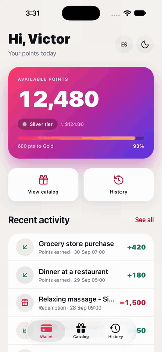
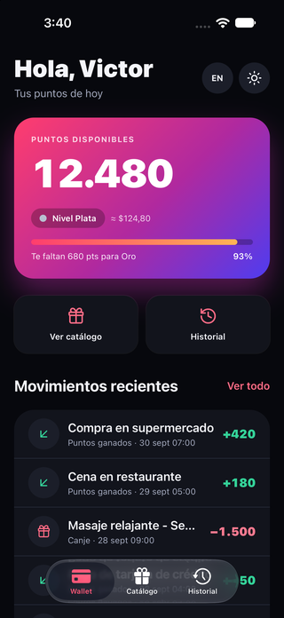
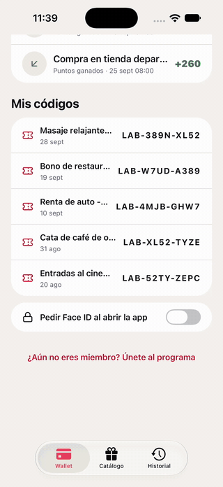

# Angular Native Lab

A public lab of [Angular Native](https://ng-native.com) demos: Angular components
rendered as real native iOS and Android views on Expo, with no WebView. Each demo
uses mock data and documents what worked and **what failed**, with the literal error.

> **Resumen en español:** Laboratorio público de demos de Angular Native (ng-native).
> Cada demo usa datos mock (sin backend ni llaves de API) y documenta con qué versión se
> probó, qué funcionó y qué falló, con el error literal. La app está en inglés y en
> español: sigue el idioma del teléfono y tiene un botón EN/ES. Se clona y se corre en
> el simulador de iOS en unos cinco minutos.

⚠️ Angular Native is in **alpha**. This repo is pinned to exact versions and documents
what breaks; it is not a production guide. Everything below was tested on simulators and emulators, never on a phone; Android coverage is
partial (see [Android](#android)).

<p>
  
  &nbsp;&nbsp;
  
</p>

## Tested with

| | Version |
|---|---|
| `@ng-native/*` | 0.5.0 (also ran on 0.4.0 and 0.3.0: tags [`ng-native-0.4.0`](https://github.com/victor198siete/angular-native-lab/tree/ng-native-0.4.0) and [`ng-native-0.3.0`](https://github.com/victor198siete/angular-native-lab/tree/ng-native-0.3.0)) |
| Angular | 22.2.1 |
| Expo SDK | 57 (`expo` 57.0.26) |
| React Native | 0.86.3 |
| TypeScript / Vitest | 6.0.3 / 5.0.3 |
| Node | 22.22.3 |
| Device | iOS 27 simulator (iPhone 18 Pro), Xcode 27, Expo Go; Android 16 emulator (Pixel 9), Expo Go and a development build |

## Getting started

Requirements: Node 22 (22.18 or later) and Xcode with an iOS simulator, or Expo Go on
your phone. No development build is needed: everything here runs in Expo Go.

```sh
git clone https://github.com/victor198siete/angular-native-lab.git
cd angular-native-lab
npm install
npm run ios        # opens the iOS simulator with Expo Go
npm start          # or scan the QR code with Expo Go on your phone
```

Checks that run in Node, with no simulator:

```sh
npm test               # Vitest against ng-native's fake native layer (86 tests)
npm run typecheck      # ngc with strict templates
npm run i18n:check     # every translation matches the extracted messages
npm run i18n:extract   # re-extract src/locale/messages.json from a Metro bundle
```

End to end with [Maestro](https://maestro.dev) and Metro running, on the iOS simulator or the
Android emulator (turn the launch lock off first; on Android, run `adb reverse tcp:8081 tcp:8081`
first, and use `APP_ID=host.exp.exponent`):

```sh
maestro test -e APP_ID=host.exp.Exponent -e APP_URL=exp://127.0.0.1:8081 .maestro/join.yaml
```

## Demos

| Demo | What it shows | Status |
|---|---|---|
| [Rewards](#rewards) | Signals + `computed()`, Router with native tabs, Tailwind v4 with `dark:`, a 200-item `<virtual-list>`, Lucide icons | ✅ iOS |
| [i18n (EN/ES)](#i18n-enes) | Angular's own i18n at runtime, device language, an in-app switch, localized numbers, dates and mock data | ✅ iOS |
| [Show at the counter](#show-at-the-counter-inside-rewards) | The voucher as a scannable QR at full brightness, screen kept on and out of screenshots, copy and share. Part of Rewards | ✅ iOS |
| [Join the program](#forms-join-the-program-inside-rewards) | Signal Forms on native inputs and switches, a mock sign-up that rejects a taken email, and what Reactive Forms and `ControlValueAccessor` do. Part of Rewards | ✅ iOS, Android |
| Device | Theme, network, safe areas and location as signals | Planned |
| [Vault](#vault-inside-rewards) | Face ID / fingerprint for the voucher codes and an opt-in lock on launch, with the preference in the keychain. Part of Rewards | ✅ iOS |
| Lists | 200 vs 2,000 items | Planned |

### Rewards

A loyalty-program demo: a wallet with an animated balance and tier progress, a catalog
of 200 rewards with category filters, a history grouped by day and a reward detail with
a redeem sheet. It was first built on ng-native 0.1.1 for the LinkedIn post below and
ported here to 0.3.0. Brands and merchants are fictional.

**What was tested:** the four screens on native tabs and a native stack, the
`:id` route param bound as an input, a redemption end to end (sheet, balance, history,
voucher code), the category filter on the virtual list, scrolling, and the dark-mode
toggle, which also restyles the native tab bar.

**What worked**

- The state layer (models, mocks, a `RewardsStore` built on signals and `computed()`)
  moved from 0.1.1 to 0.3.0 **without changing a line**, tests included.
- The UI components and screens also compiled and ran on 0.3.0 as they were.
- Tailwind v4 with `dark:`, `@ng-native/icons` with `@ng-icons/lucide`, and
  `<virtual-list>` behaved the same as on 0.1.1.
- Component tests run in Node with `@ng-native/testing`: no simulator in CI.

**What failed or needed work**

- **The 0.3.0 template no longer ships** `@ng-native/router`, `@ng-native/tailwind` or
  `@ng-native/icons`. They have to be installed (and pinned) by hand, along with
  `react-native-screens` and `react-native-svg` through `npx expo install`. Its
  `src/main.ts` also gained an `import 'expo'` the 0.1.1 one did not have.
- Metro warns at startup. Both warnings are harmless, but they are there:
  ```
  [angular-native] .visible (Tailwind): dropped 'visibility': 'visibility' has no React
  Native equivalent: no style prop of a native view does what it does. Use opacity: 0 to
  hide a box and keep its space, or display: none to remove it.
  [angular-native] .table (Tailwind): dropped 'display': display: table does not exist on
  native; only flex, block (read as flex), contents and none do
  ```
  Tailwind scans every file for class names, so words like "visible" and "table" in the
  source and this README become classes the native side then drops.
- In development, each tab is **blank for 2–3 seconds the first time it opens** while
  Metro bundles that lazy route (2.6 s for the catalog). A release build was not tested.
- My own mistake, not ng-native's: moving a file during the port broke an import,
  `TS2307: Cannot find module '../../core/theme.ts'`. Typecheck caught it.
- Expo Go draws a floating tools button over the top-right corner of the app. It can be
  hidden from its developer menu ("Tools button").

### i18n (EN/ES)

English is the source language; Spanish is a translation. The app picks the language
saved in the app, then the phone's languages in order, then English. It follows
[ng-native's localization guide](https://ng-native.com/guide/localization): Angular's
`i18n` and `$localize`, messages extracted from the Metro bundle with
`localize-extract`, and translations loaded with `loadTranslations()` before the first
frame.

**What was tested:** 79 messages (templates, accessibility labels and computed strings),
the phone in English and in Spanish, the EN/ES button, a cold start after switching,
and numbers, dates and mock data in both languages.

**What worked**

- Runtime translation in Expo Go: one build carries both languages.
- Numbers and dates through Angular's locale data and `LOCALE_ID`: `12,480` /
  `12.480`, `$124.80` / `$124,80`, `30 Sep` / `30 sept`.
- **Switching language with `reloadAppAsync()` works in Expo Go on the iOS simulator.**
  The guide marks it as unverified on a device. The choice is saved with
  `expo-secure-store` and survives closing the app.
- `localize-extract` on an unminified Metro bundle extracted all 79 messages;
  `npm run i18n:check` compares every translation with them.
- The Babel pin the guide asks for held: Babel 8 only appears under
  `@angular/localize` and `@angular/compiler-cli`; React Native stays on 7.29.7.

**What failed or needed work**

- A Vitest test that imports a file which imports `expo-secure-store` or
  `@ng-native/expo/locale` fails before any test runs:
  ```
  RolldownError: Parse failure: Parse failed with 1 error:
  Flow is not supported
  At file: /node_modules/react-native/index.js:1:0
  ```
  Fix: keep native imports out of what components and tests import. Here
  `language.ts` is pure, `localization.ts` holds the native providers, and the switch
  reaches the native side through an injection token (`LANGUAGE_RESTART`).
- Rendering with `LOCALE_ID` set to `es` before registering its locale data:
  ```
  NG0701: Missing locale data for the locale "es".
  ```
  Fix: `registerLocaleData(localeEs)` next to the translations, so whatever loads one
  loads the other.
- A test that created a `providedIn: 'root'` token through `Injector.create()`:
  ```
  NG0201: No provider found for `InjectionToken REWARDS_SOURCE`.
  ```
  That is Angular, not ng-native: a root token needs a root injector. The check moved to
  a component test.
- **Not tested, avoided by design:** ICU plurals and selects, and `i18n-` attributes.
  The guide documents both as broken, so this app uses `$localize` strings instead.
- `$localize` at module level runs before the translations load and stays in English.
  Tier and category names are translated inside functions for that reason.

### Vault (inside Rewards)

Biometrics in the same app instead of a separate demo, so it maps onto a real product: the
wallet's **My codes** hides the voucher codes of recent redemptions until Face ID passes, and a
switch turns on **Face ID when the app opens**. Built on `Biometrics`
(`@ng-native/expo/biometrics`, over `expo-local-authentication` 57.0.3) and `SecureStorage`
(`@ng-native/expo/secure-store`).

Design choices, kept the way a production app would have them:

- The codes come from the redeem movements (an API in a real app). **Nothing about them is
  stored on the device**; the keychain holds only the lock preference.
- One authentication unlocks the session, for the codes and the app, until it restarts.
- Turning the lock on asks for Face ID first, so it cannot be enabled on a phone that would
  then fail to open it. With no usable sensor, the lock screen offers to turn the lock off (the
  lab has no password to fall back to; a real app would ask the person to sign in again).

**What was tested:** on the iOS simulator with Face ID enrolled, inside **Expo Go**: reading the
sensor kind, revealing the codes, turning the lock on, relaunching into the lock screen, a face
that does not match, cancelling, and unlocking. In Node: the same flows with a fake sensor
(`Biometrics.SOURCE`) and an in-memory keychain (`new Store(native)` from
`@ng-native/expo/store`).

**What worked**

- **Face ID works in Expo Go on the iOS simulator**; no development build was needed. `kinds()`
  reported `face`, the system Face ID sheet appeared, and a matching face resolved
  `{ success: true }`.
- A non-matching face shows iOS's own "Face Not Recognized" dialog; cancelling it resolves
  `user_cancel`, and the app says so in the active language.
- `SecureStorage` reads synchronously, so the route guard sees the stored preference on the very
  first navigation: the app opens straight on the lock screen, with no flash of the wallet.
- Without a fake, in Node, `authenticate()` resolves `{ success: false, error: 'not_available' }`:
  the lock fails closed, as ng-native's docs promise.
- `<switch>` is controlled: when Face ID fails, the app keeps `false` and the switch flips back
  by itself.

**What failed or needed work**

- The first reveal attempt failed with
  ```
  unknown: -1000, Authentication failure.
  ```
  and the second one passed. Our guess is the simulated face was sent too late, after the sheet
  had given up; it was not confirmed. The app shows such errors verbatim inside a generic
  sentence, since they come from the platform.
- Importing `Biometrics` or `SecureStorage` in Vitest works (unlike `expo-secure-store` itself;
  see i18n). Creating them with `Injector.create()` fails with `NG0201: No provider found for
  InjectionToken angular-native.biometricsSource`: they need a root injector, as `render()` has.
- In tests, `userEvent.press()` does not flip a `<switch>`; it listens for the native `change`
  event: `fireEvent(node, 'change', { value: true })`.
- Driving the simulator from scripts: the Face ID sheet waits for
  `xcrun simctl spawn booted notifyutil -p com.apple.BiometricKit_Sim.pearl.match` (or
  `.nomatch`), after enrolling with `com.apple.BiometricKit.enrollmentChanged`. Taps sent from
  outside the Simulator window did not flip a native `UISwitch`; a person had to.

### Show at the counter (inside Rewards)

A redemption's code, ready for the partner to scan: **Show at the counter** on the success
screen, or a code in **My codes**, opens the voucher as a QR. While it is open, the app raises
its own brightness to full, keeps the screen on and keeps it out of screenshots; all three are
put back when it closes. Copy and Share sit underneath, and a redemption ends with a success or
error haptic.

The QR needs no QR library for React Native: `qrcode-generator` (MIT, no dependencies) makes the
matrix, each row's run of dark cells becomes one rectangle in a single `<path>`, and
`<ng-icon [svg]>` from `@ng-native/icons` draws that markup as native react-native-svg shapes.

**What was tested:** on the iOS simulator in Expo Go: the QR on screen, decoding it, Copy, Share,
and the two ways in. In Node: every module faked through its `SOURCE` token, checking what the app
asks the phone to do and that it is all undone on close.

**What worked**

- **The QR scans.** A simulator screenshot decoded with macOS's own Vision framework read
  `LAB-52TY-ZEPC`, the code printed under it. A version-1 code is one `RNSVGPath`.
- **Copy:** the simulator's pasteboard (`xcrun simctl pbpaste booted`) held the code, and the
  button said "Copied".
- **Share:** the system share sheet opened with the message in the active language.
- All of it in Expo Go: `expo-brightness`, `expo-keep-awake`, `expo-screen-capture`,
  `expo-haptics` and `expo-clipboard` needed no development build.
- In Node, closing the screen calls `restore()`, releases the `voucher` keep-awake tag and
  allows capture again for the `voucher` key.

**What could not be checked here, so is not claimed**

- **Brightness and haptics** have nothing to see or feel on a simulator; the tests only show the
  calls.
- **Screenshot prevention:** `xcrun simctl io booted screenshot` captured the voucher anyway. It
  grabs the frame from outside iOS, so it says nothing about what the user's own screenshot
  would do; that needs a phone. The "a screenshot was taken" warning is tested in Node only.
- **Keep awake:** not observable in a short session.

### Forms: Join the program (inside Rewards)



A member sign-up, reached from the wallet ("Not a member yet? Join the program"): name, email,
an optional phone, a promotions switch and a terms switch. It uses
[Signal Forms](https://angular.dev/guide/forms/signals/overview) bound straight to the native
controls, as [ng-native's forms guide](https://ng-native.com/guide/forms) describes:
`<text-input>` takes `value` and `<switch>` takes `checked`, both models, with no adapter class.
The sign-up is a mock that takes about a second and answers that `taken@example.com` is already
registered.

**What was tested:** on the iOS simulator and the Android 16 emulator in Expo Go, driven by
the same Maestro flow ([`.maestro/join.yaml`](.maestro/join.yaml), recorded in the GIF on iOS):
an empty submit, the taken email, fixing it and joining. In Node: validation, the red border, the server error, success and
the way in from the wallet, plus [a test](src/app/demos/rewards/features/join/forms-compatibility.test.ts)
of every other Angular form pattern on a `<text-input>`.

**What worked**

- **Signal Forms is stable in Angular 22.** Everything used here (`form`, `FormField`,
  `required`, `minLength`, `email`, `pattern`, `validate`, `submit`) is `@publicApi 22.0` in
  `@angular/forms/signals`; only `provideExperimentalWebMcpForms` is still experimental.
  `@angular/forms` has to be pinned to the exact `@angular/core` version (22.2.1).
- `[formField]` on `<text-input>` and `<switch>` binds both ways with nothing else.
- `submit()` marks every field touched, calls `onInvalid` (a warning haptic here) when something
  is wrong, and only runs `action` on a valid form. While it runs, `submitting()` disables the
  button and changes its label. The "already registered" answer comes back from `action` with
  `fieldTree: f.email` and shows under the email like any validation error.
- The invalid look is plain CSS in the component, compiled at build time:
  `.field[data-invalid][data-touched] { border-color: ... }`, with a dark-mode colour.
- Email and phone keyboards, autofill hints and accessibility labels are ordinary props.
- Labels and messages come from the same i18n as the rest of the app.
- 0.4.0's HTML elements, which need no import, draw the layout and copy: `section`, `h1`, `p`,
  `label`, `div`.
- **Reactive Forms and `ngModel` work too, and so does a control of your own with
  `ControlValueAccessor`**, on iOS, on Android and in Node. The guide is right that ng-native's
  components do not implement `ControlValueAccessor`; they do not need to. In `@angular/forms`
  22.2.1, when an element has no value accessor but has a `value` model, `[formControl]` and
  `ngModel` bind to that model directly, so they work on `<text-input>` as they are. Checked on a
  temporary screen with Maestro, on both platforms:

  | Pattern | Result |
  |---|---|
  | `[formControl]` on `<text-input>` | Typing reaches the `FormControl`, `setValue()` reaches the field, leaving it marks it touched, `disable()` stops typing |
  | `[(ngModel)]` on `<text-input>` | Both ways (Node) |
  | A custom control with `ControlValueAccessor`, bound with `[formControl]` | Both ways |
  | The same control bound with Signal Forms `[formField]` | Both ways |

  The custom control keeps its value in a signal: the app is zoneless, so a plain field set from
  `writeValue()` would not redraw. Not tried on a phone.

**What failed or needed work**

- **`pattern()` lets an empty value through.** A 10-digit phone pattern does not make the phone
  required, so the field is labelled optional; adding `required()` would be the fix if it were not.
- **Forgetting `FormField` in `imports`** binds nothing: the field stays empty and typing never
  reaches the form. The guide says this compiles and logs in development. The log is there:
  ```
  [angular-native] Can't bind to 'formField' on <text-input>: no directive in its template
  takes it, so it binds nothing. Add FormField from '@angular/forms/signals' to the
  component's `imports`.
  ```
  But `npm run typecheck` (ngc with strict templates) does not compile it, so it is caught
  before running:
  ```
  NG8002: Can't bind to 'formField' since it isn't a known property of 'text-input'.
  ```
  Metro's build does not type-check, so the app still builds and runs with the mistake.
- **`data-invalid` and `data-touched` are not native props.** They exist only for the CSS
  selector, so a test cannot read them from the rendered view; the tests check the border colour
  instead.
- **HTML elements are views, not the web.** A `div` lays its children out in a column, as every
  native view does. Angular drops text nodes that are only whitespace, so a space between two
  pieces of text disappears; `&nbsp;` keeps it.
- **On the Android emulator, the keyboard and Maestro got in the way, not the app.** Gboard
  stopped once with `Fatal signal 4 (SIGILL)` in its spell checker and then opened its stylus
  tutorial over the form. Maestro's `hideKeyboard` presses back when no keyboard is up, which
  leaves Expo Go, so the flow closes the keyboard by tapping the intro text instead. Expo Go also
  keeps a screen's state when sent to the background: a rerun typed into fields that still held
  the last run's text. Start each run from a closed Expo Go.
- Simulators and emulators only. The keyboard covering the submit button was not looked at.

## Module coverage

Every native module this lab uses, where it was tested and what it needed. ✅ worked, ⚠️ worked
with a caveat, — not tested there.

| Module | Package | Used for | iOS sim, Expo Go | Dev build needed | Tested on device | Notes |
|---|---|---|---|---|---|---|
| `Locale` | `@ng-native/expo/locale` (`expo-localization`) | Device language for i18n | ✅ | No | — | |
| `SecureStorage` | `@ng-native/expo/secure-store` | Language choice, lock preference | ✅ | No | — | Reads synchronously, so guards see it on launch |
| `Biometrics` | `@ng-native/expo/biometrics` (`expo-local-authentication`) | Vault | ⚠️ | No | — | First prompt once failed with `unknown: -1000`; Face ID usage string needed for dev builds |
| `Brightness` | `@ng-native/expo/brightness` | Voucher | — | No | — | Calls verified in Node; nothing to see on a simulator |
| `KeepAwake` | `@ng-native/expo/keep-awake` | Voucher | — | No | — | Calls verified in Node |
| `ScreenCapture` | `@ng-native/expo/screen-capture` | Voucher | ⚠️ | No | — | `simctl` screenshots are not blocked (taken from outside iOS) |
| `Haptics` | `@ng-native/expo/haptics` | Redeem, copy, join | — | No | — | No haptics on a simulator |
| `Clipboard` | `@ng-native/expo/clipboard` | Copy the code | ✅ | No | — | |
| `Sharing` | `@ng-native/device` | Share the code | ✅ | No | — | `true` means a target was chosen, not delivered |
| `NgIcon` with `[svg]` | `@ng-native/icons` (`react-native-svg`) | Lucide icons, the QR | ✅ | No | — | Parser handles `svg`, `g`, `path`, `rect`… |
| `ColorScheme` | `@ng-native/device` | Dark mode | ✅ | No | — | |
| Router, native tabs and stack | `@ng-native/router` | All navigation | ✅ | No | — | |
| Signal Forms on `<text-input>` and `<switch>` | `@angular/forms/signals` | Join the program | ✅ | No | — | `pattern()` lets an empty value through. Also ✅ on the Android emulator |
| Reactive Forms, `ControlValueAccessor` | `@angular/forms` | Compatibility check only | ✅ | No | — | Angular binds `[formControl]` and `ngModel` to the `value` model; no accessor needed. Also ✅ on the Android emulator |

## Upgrading to 0.5.0

0.5.0 came out on 5 October 2026. All ten `@ng-native/*` packages moved from 0.4.0 to 0.5.0 with **no
change to the app**: typecheck clean, the 86 tests passing, `expo install --check` asking for
nothing. On the iOS simulator, after restarting Metro with `--clear`: Join the program end to end
(Maestro), the wallet, catalog, history, a redemption through to the voucher QR, Copy and Share.

- The one breaking change, an `<ng-icon>` with no `size` now being `1em` instead of 24 points, does
  not touch the lab: every icon here has a size.
- The forms compatibility test passes as before (Reactive Forms, ngModel, `ControlValueAccessor`).
  0.5.0 also fixes a custom form control under `[formField]` failing with `NG01914` after a hot
  stylesheet swap ([#547](https://github.com/ng-native/ng-native/pull/547)), which the lab had not run into.
- The only code change in this upgrade was the lab's own: an unused `View` import in the Join screen,
  which the typecheck reports as `NG8113`.
- Not in 0.5.0: the Android `<virtual-list>` crash below ([#558](https://github.com/ng-native/ng-native/issues/558)),
  opened 12 minutes before the release.

## Upgrading to 0.4.0

All ten `@ng-native/*` packages moved from 0.3.0 to 0.4.0 with **no code change**: typecheck clean,
every test passing with no new warnings, and the iOS demos behaving as before (lock, wallet,
catalog, a scannable voucher QR, deep links). `expo install --check` asked for nothing.

## Android

First run on the Android 16 emulator (Pixel 9, API 36), in Expo Go and in a development build.

**What worked:** launch, the wallet, i18n from the device language, the balance animation, the tab bar
and [Join the program](#forms-join-the-program-inside-rewards), forms compatibility included (rechecked
on 0.5.0).

**What failed**

- **Opening the catalog stops the app**, on 0.3.0, 0.4.0 and 0.5.0, in Expo Go and in a development build
  ([ng-native/ng-native#558](https://github.com/ng-native/ng-native/issues/558)):
  ```
  addViewAt: failed to insert view [1073742902] into parent [1073742906] at index 1
  ScrollView can host only one direct child
  ```
  Narrowed down: any `<virtual-list>` with `listHeader` or `listFooter` content does it; one without
  them, and `<scroll-view>` with several children, vertical or horizontal, do not. The catalog's
  count is a `listFooter`. Reported upstream as [#558](https://github.com/ng-native/ng-native/issues/558); the lab keeps the footer so the result stays
  reproducible.
- **The in-app language switch does not restart the app** (0.4.0 and 0.5.0, Expo Go). The choice is
  saved, but `reloadAppAsync` never reloads: the button stays disabled, its accessibility state
  reading "English, busy", until Expo Go is closed and opened again, which then starts in the new
  language. The same button reloads straight away on the iOS simulator. ng-native's localization
  guide says Android's behaviour here is unverified. Not reported yet.
- **Tabs have no icons on Android.** Not a bug: ng-native warns that Android reads only `drawable`,
  and the lab uses SF Symbols, which are iOS only.

## Not tested yet

On Android: the catalog (it stops the app), history, the reward detail, the vault and the voucher.
Everywhere: a release build, a physical device (Face ID
on a real phone included) and any performance measurement. Nothing
in this README claims performance numbers.

## Project structure

```
src/
  main.ts                    mounts the app: router, Tailwind, localization
  locale/                    messages.json (extracted) and messages.es.json
  app/
    app.routes.ts            the app opens straight into the Rewards demo for now
    core/                    shared by every demo: theme, i18n
    demos/rewards/           core (models, mocks, store), shared UI, features, shell
```

## Notes

- `npm audit` reports 13 vulnerabilities (8 moderate, 5 high), all inside Expo's own
  tooling (`@expo/cli`, `@expo/config`, `node-forge`, `uuid`, `xcode`). They come with
  Expo SDK 57; `npm audit fix --force` would break the pinned versions, so they are left
  as they are.
- Mock data only: no backend, no API keys, no environment files.

## Why this exists

This repo backs my posts about Angular Native on
[LinkedIn](https://lnkd.in/p/eQYqFj7e). Each post links to the demo that supports it.

## Credits

- [Ashley Hunter](https://github.com/ashley-hunter), creator of Angular Native
  ([ng-native/ng-native](https://github.com/ng-native/ng-native)).
- The app starts from the
  [`@ng-native/template`](https://www.npmjs.com/package/@ng-native/template) template.

## License

MIT © 2026 Víctor Moreno
